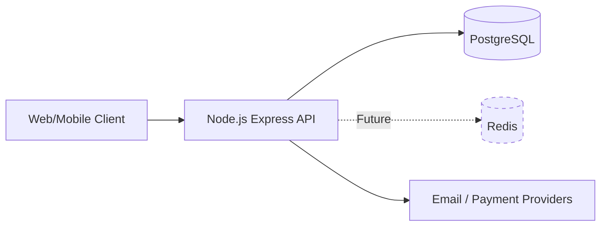
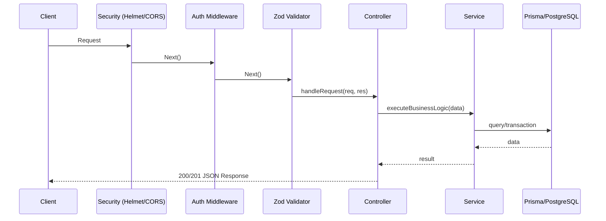
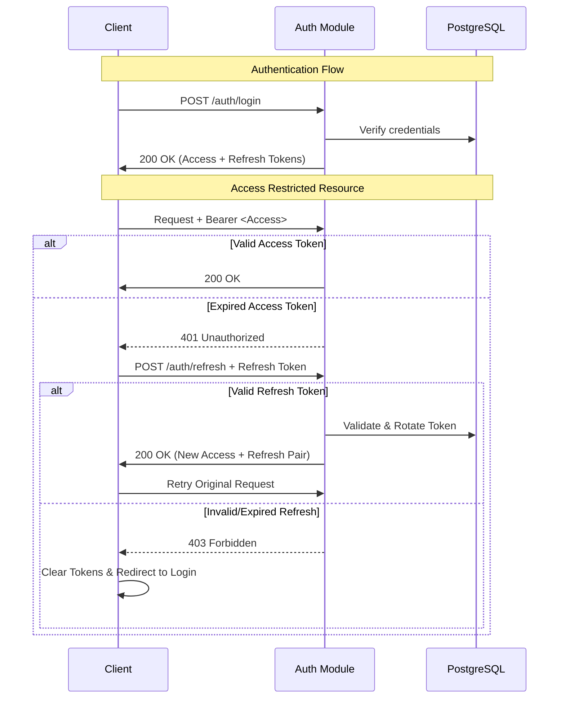
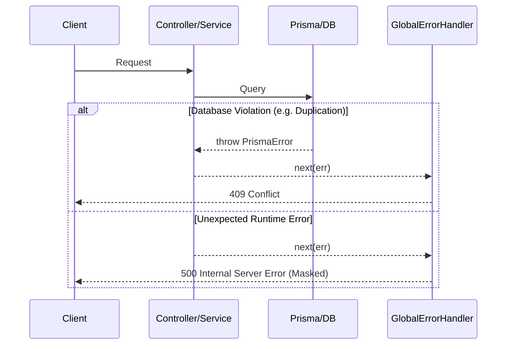

# Architecture Overview

This document outlines the high-level architecture, design patterns, and engineering trade-offs made in the Jolie Brasserie backend. This is a production-grade REST API designed for high maintainability and type-safe data flow.

---

## 🧱 System Architecture (Macro View)

The following diagram illustrates the relationship between the core API, data persistence layers, and external service providers.

---

## 🌊 Request Lifecycle

Every request follows a predictable path through several layers of defense and processing before reaching the database.

---

## 🔐 Authentication Flow

We utilize a stateless JWT strategy with rotation-based refresh tokens.

---

## 🧪 Error Handling Strategy

Errors are treated as first-class citizens. They are not just "caught"—they are transformed into structured responses.

---

## ⚙️ Key Design Decisions

### 1. Controller-Service Pattern
We strictly separate the **Transport Layer** (HTTP) from the **Business Layer**. 
- **Controller**: Extracts `req.body`, handles `res.status`, and interfaces with Express.
- **Service**: Executes the actual logic. Services are agnostic of Express; they can technically be reused in CLI tools or Cron jobs without modification.

### 2. Boundary Validation (Zod)
We validate all inputs precisely at the entry point of the controller. This guarantees that any data entering the `Service` layer is already typed and sanitized at runtime, eliminating the need for repetitive "if-null" checks.

### 3. Financial Integrity (decimal.js)
Standard JavaScript `Number` types use binary floating-point representation, which leads to precision errors (e.g., `0.1 + 0.2 = 0.30000000000000004`). For price calculations, we enforce the use of `decimal.js` to ensure 100% accuracy in subtotals, taxes, and fees.

---

## ⚖️ Trade-offs

### JWT vs. Server-side Sessions
- **Why JWT**: Enables horizontal scaling (API nodes don't need shared state) and reduces database load per request.
- **Why NOT Sessions**: Managing multi-node sessions usually requires Redis/Memcached prematurely.
- **Downside**: Revoking a single compromised "Access Token" immediately is difficult.
- **Mitigation**: We use short-lived access tokens (15m) and store refresh tokens in the DB, allowing us to "blacklist" a user's session by deleting their refresh token.

### Prisma vs. Raw SQL (TypeORM/Drizzle)
- **Why Prisma**: Unparalleled developer experience and type safety. The auto-generated client reduces boilerplate and prevents runtime errors.
- **Downside**: Prisma adds a performance overhead due to its Rust-based query engine compared to thinner ORMs like Drizzle.
- **Mitigation**: We leverage `@prisma/adapter-pg` for better connection management and use transactions (`$transaction`) only where strictly necessary.

---

## 📊 Scalability Considerations

1.  **Horizontal Scaling**: The API is stateless. We can spin up multiple instances behind a load balancer without any session issues.
2.  **Database Bottlenecks**: As traffic grows, we plan to implement **Prisma Read Replicas** to offload `GET` requests from the primary database node.
3.  **Caching**: While currently synchronous, we have architectural slots for a **Redis** layer to cache expensive `/dishes` and `/ingredients` queries.
4.  **Task Offloading**: Currently, emails are sent synchronously. As we scale, we will migrate to an **Asynchronous Queue (BullMQ/RabbitMQ)** to prevent mail provider latency from affecting response times.

---

## ⚠️ Known Limitations

- **No Real-time Updates**: Status changes (e.g., "Order Cooking") require page refreshes. Future roadmap includes **WebSockets** or **SSE**.
- **No Distributed Cache**: High-traffic bursts may strain the PostgreSQL instance.
- **Simulated Payments**: The payment module currently mocks external gateway interactions.
- **Development Mailer**: Uses **Ethereal**; a production-ready SMTP provider (SES/SendGrid) is required for deployment.

---

## 📈 Observability

- **Structured Logging**: Every request is logged via **Pino** in a standardized JSON format, ready for ELK or Datadog ingestion.
- **Request Correlation**: Each request includes a unique `X-Request-Id` header to bridge logs between the API and future microservices.
