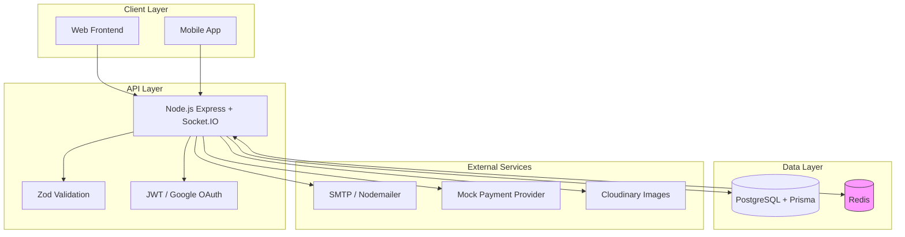
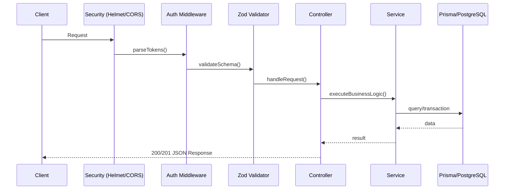
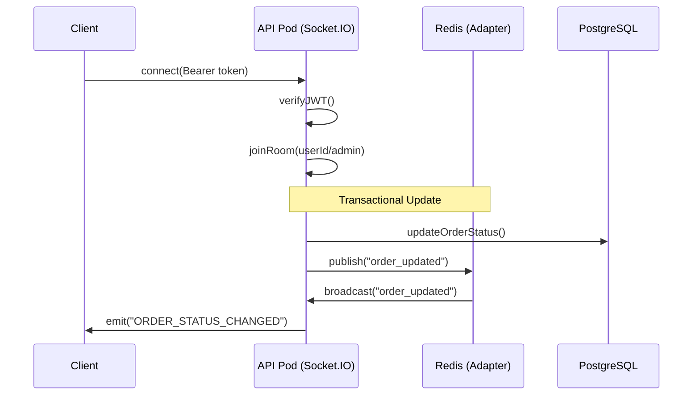

# Architecture Overview

This document outlines the high-level architecture, design patterns, and engineering trade-offs made in the Jolie Brasserie backend. This is a production-grade REST API and Real-time system designed for high maintainability, observability, and type-safe data flow.

---

## 🧱 System Architecture (Macro View)

The following diagram illustrates the relationship between the core API, data persistence layers, and external service providers.

---

## 🌊 Request Lifecycle & Real-time Flow

Every request follows a predictable path through several layers of defense. Real-time events are bridged via Redis for horizontal scaling.

### REST Request

### Real-time Event (Socket.IO)

---

## 🔐 Authentication Flows

### JWT Strategy
We utilize a stateless JWT strategy with rotation-based refresh tokens stored in httpOnly cookies for maximum security.

1. **Access Token**: Short-lived (15m), sent in `Authorization` header.
2. **Refresh Token**: Long-lived (7d), sent as an `httpOnly` cookie. Rotated on every refresh.

### Google OAuth Flow
Implemented using the state-token pattern to prevent CSRF:
1. Client initiates via `GET /auth/google`.
2. Backend generates a `state` token (stored in Redis) and redirects to Google.
3. Google callbacks to `/auth/google/callback` with a `code`.
4. Backend verifies `state`, exchanges `code`, and redirects frontend with a one-time `exchangeCode`.
5. Frontend exchanges `exchangeCode` for full JWT tokens.

---

## 🧪 Key Design Decisions

### 1. Unified Modular Architecture
Code is organized into Domain-Specific Modules (e.g., `dish`, `order`, `auth`) located in `src/modules`. Each module encapsulates its own routes, controllers, and services, promoting high cohesion and low coupling.

### 2. Controller-Service separation
- **Controller**: Handles HTTP specifics (parsing params, setting headers, calling services).
- **Service**: Pure business logic. Services are agnostic of Express and can be safely called from CLI tasks or background jobs.

### 3. Precision Financial Calculations (decimal.js)
To avoid floating-point errors (e.g., `0.1 + 0.2 != 0.3`), we use `decimal.js` for all price, fee, and tax calculations. Database storage uses the `Decimal` type via Prisma/PostgreSQL.

### 4. Real-time Horizontal Scaling
We use the **Socket.IO Redis Adapter**. This allows us to scale the API nodes horizontally; an event emitted on Node A is broadcasted to clients connected to Node B via the Redis pub/sub layer.

### 5. Type-Safe Data Flow (Prisma + Zod)
- **Prisma**: Auto-generated type definitions from the database schema ensure compile-time safety for all DB operations.
- **Zod**: Runtime validation at the API boundary ensures that only valid, sanitized data reaches the core business logic.

---

## ⚖️ Trade-offs

### JWT vs. Sessions
- **Decision**: JWT for scalability.
- **Trade-off**: Hard revocation is difficult. 
- **Mitigation**: Refresh token rotation in the database allows us to invalidate sessions immediately by deleting the refresh record.

### Redis as Shared State
- **Decision**: Redis is used for transient state (OAuth tokens, Socket.IO adapter) but not for primary business state.
- **Trade-off**: System depends on Redis availability for real-time and Auth features.
- **Mitigation**: Redis is deployed as a sidecar with persistence (`AOF`) enabled.

---

## 📈 Scalability & Observability

### Health Checks
The system exposes two standard probes:
- `/healthz`: Liveness probe (is the process up?).
- `/readyz`: Readiness probe (are DB and Redis connections healthy?).

### Structured Logging
We use **Pino** for structured JSON logging. In development, logs are "prettified" for readability. In production, they are sent as raw JSON for easy ingestion into centralized log management systems.

### Horizontal Scaling
The entire stack is **Stateless**. Any API instance can handle any request, provided it has access to the PostgreSQL primary and the Redis cluster.

---

## ⚠️ Known Limitations
- **Payments**: Currently utilizes a mock service; ready for Stripe/Braintree integration.
- **Mail Blocking**: Emails are sent via SMTP; high-volume traffic would benefit from a dedicated queue (BullMQ/Redis).

